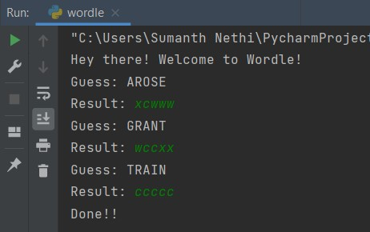

# Wordle-Bot
As the name suggests, it is a bot that plays wordle. Built a wordle bot that provides an optimum guess at each step, thereby minizing the number of guesses to win.  

At each step input the result to the bot as a string of characters. 
* c - character present and in correct spot
* w - charcacter not present
* x - character present but in a different spot

# Example
Lets see how our bot performs for the word 'TRAIN'  

